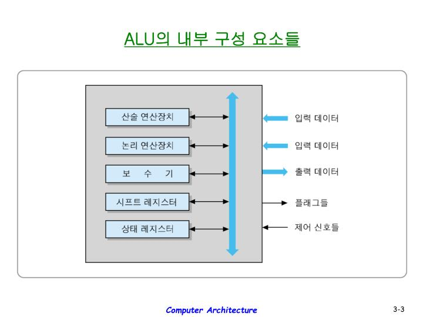
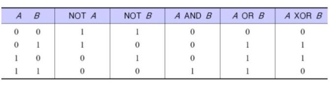
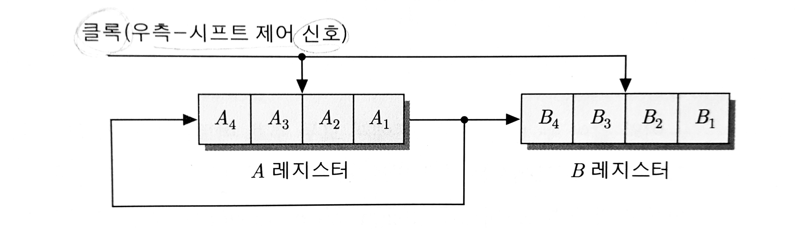
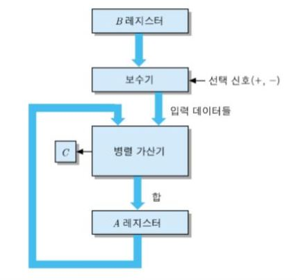
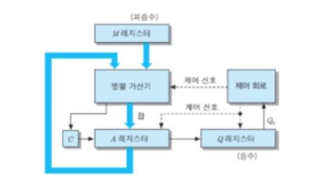
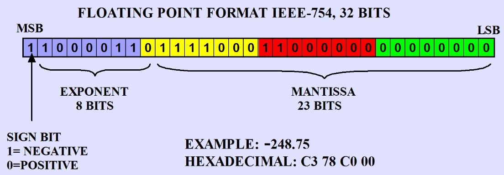
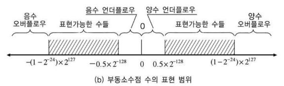

### chap.3 컴퓨터 산술과 논리연산

---

산술 및 논리 연산에 대해 알아본 후, ALU의 내부 조직에 대해 공부한다.

#### 3.1 ALU의 구성요소

 ALU는 수치 및 논리데이터에 대해 실제적으로 연산을 수행하는 하드웨어 모듈이다. 다음 그림은 ALU의 내부 요소들을 보여주고 있다.

|    내부 요소    |                    주요 기능                     |
| :-------------: | :----------------------------------------------: |
|  산술연산장치   |                산술 연산들을 수행                |
|  논리연산장치   |                논리 연산들을 수행                |
| 시프트 레지스터 | 비트들을 좌/우로 이동시키는 기능을 가진 레지스터 |
|     보수기      |          데이터에 대해 2의 보수를 취함           |
|  상태 레지스터  |   연산 결과의 상태를 나타내는 플래그 레지스터    |

 데이터들은 레지스터/기억장치 로부터 ALU로 입력되고, 그 결과는 일반적으로 레지스터의 어딘가에 저장된다. ALU는 연산의 결과에 따라 상태 레지스터내의 해당 플래그들을 세트하는데, 이 플래그들은 조건 분기 명령어/산술 명령어들에 의해 사용된다. 입력 데이터에 대하여 연산을 수행할 내부 요소의 선택과 ALU 내외로의 데이터 이동을 제어하는 신호는 제어 유닛으로부터 제공된다.

#### 3.2 정수의 표현

 컴퓨터가 데이터를 저장하는 과정에서는 2진수 체계를 사용한다. 2진수 계산법은 생략한다. 8bit 체제에서 2진수로 양수를 나타낼 경우 8개의 bit를 전부 사용하면 된다. 그러나 음수를 나타낼 경우 일반적으로 제일 좌측에 있는 bit를 부호 비트(sign bit)로 사용한다. 부호 비트가 0이면 양수, 1이면 음수를 나타낸다.

 부호 비트를 사용하는 2진수 표현으로는 다음과 같은 세 가지 방법들이 있다.

- 부호화-크기 표현
- 1의 보수 표현
- 2의 보수 표현

**3.2.1 부호화-크기 표현**

  n개의 비트로 크기를 표현할 경우 가장 좌측의 비트는 부호를, 나머지 n - 1개의 비트들은 수의 크기를 나타내는 방법이다. 간단하지만 결점이 존재하는 방식.

- 결점 1: 덧셈과 뺄셈을 하기 위해서는 부호 비트와 크기 부분을 별도로 처리해야 한다.
- 결점 2: 0에 대한 표현이 두가지이다. (0 0000000, 1 0000000)

이러한 결점들로 인해 계산 과정이 더 복잡해지며, n개의 비트로 표현할 수 있는 수들의 가짓수가 1 줄어든다.

**3.2.2 보수 표현**

 보수 표현이란 0을 1로, 1을 0으로 바꾸는 표현방식이다. 보수 표현에는 두 가지 방식이 있다.

- 1의 보수 표현: 모든 비트들을 반전한다.
- 2의 보수 표현: 모든 비트들을 반전하고, 결과값에 1을 더한다.

 변환하는 과정은 1의 보수 표현이 더 간단하지만 표현할 수 있는 수의 가짓수는 2의 보수 표현이 더 많다. 1의 보수 표현 방식은 0을 나타내는 방식이 두개이기 때문.

|   명칭   |            표현법             |   범위    |
| :------: | :---------------------------: | :-------: |
| 1의 보수 |      모든 비트들을 반전       | -127~+127 |
| 2의 보수 | 반전시킨 후 결과값에 1을 더함 | -128~+127 |

**3.2.3 부호-비트 확장**

 컴퓨터에서 어떤 수가 기억장치에 저장되어 있을 때 그 길이와 CPU 연산과정에서의 길이가 서로 다른 경우가 있다. 기억장치에 8bit로 저장된 데이터를 16bit레지스터로 옮겨올 경우 8bit 데이터의 길이를 확장시켜야 하는데 2의 보수 표현 방식은 다음과 같은 방식을 따라서 확장한다.

- sign bit가 0일 경우: 빈 공간을 0으로 채운다.
- sign bit가 1일 경우: 빈 공간을 1으로 채운다.

이 방식을 *부호-비트 확장* 이라고 한다.

#### 3.3 논리 연산

 다음은 두 개의 비트 A, B에 대해 처리될 수 있는 기본적인 논리 연산들을 나타낸다.

 비트 단위의 논리 연산들을 위한 하드웨어 모듈은 4 X 1 MUX등으로 만들 수 있다. 여러 비트의 경우 4 X 1 MUX를 여러개 이용하여 각각의 MUX에 공통으로 연산 선택 신호를 인가하는 방식으로 만들 수 있다.

 대표적인 몇 가지 논리 연산들은 다음과 같다.

1. AND 연산: 두 개의 데이터에서 같은 위치에 있는 비트들이 모두 1인 경우 결과 데이터의 해당 비트가 1이 된다. 그 이외에는 결과 데이터의 해당 비트가 0이 된다.
2. OR 연산: 두 개의 데이터에서 같은 위치에 있는 비트들이 하나라도 1인 경우 결과 데이터의 해당 비트가 1이 된다. 두 비트가 모두 0일 경우 결과 데이터의 해당 비트가 0이 된다.
3. XOR 연산: 두 개의 데이터에서 같은 위치에 있는 비트들이 서로 다른 값을 가지면 결과 데이터의 해당 비트가 1이 되고, 같은 위치에 있는 비트들이 같은 값을 가지면 결과 데이터의 해당 비트가 0이 된다.
4. NOT 연산: Word의 모든 비트들이 반전된다.
5. 선택적-세트 연산: 데이터의 특정 비트들을 1로 세트해주는 동작이다. 데이터가 저장된 A 레지스터와 1로 세트될 비트들의 위치를 지정해주는 B 레지스터 간에 OR 연산을 수행하면 된다.
6. 선택적-보수 연산: 데이터의 특정 비트들의 값을 보수화하는 동작이다. 데이터가 저장된 A 레지스터와 보수화할 비트들의 위치를 지정해주는 B 레지스터 간에 XOR 연산을 수행하면 된다.
7. 마스크 연산: 데이터 내 특정 비트들의 값을 0으로 리셋 시키기 위한 동작이다. 데이터가 저장된 A 레지스터와 위치를 지정해주는 B 레지스터 간에 AND 연산을 수행하면 된다.
8. 삽입 연산: 데이터 내의 일부 비트들을 새로운 값들로 대체시키기 위한 동작이다.
   - 단계 1: 삽입하고자 하는 비트들에 대하여 마스크 연산을 수행, 그 값들을 0으로 초기화한다.
   - 단계 2: 새로이 삽입할 비트들과 그 결과 데이터 간에 OR 연산을 수행한다.
9. 비교 연산: A와 B 레지스터의 내용을 비교하고, 만약 두 레지스터에서 대응되는 비트들의 값이 같으면, A 레지스터의 해당 비트를 0으로 세트한다. 서로 다르다면 A 레지스터의 해당 비트를 1로 세트한다. 두 레지스터들 간에 XOR 연산을 수행함으로써 구현할 수 있다.

#### 3.4 시프트 연산

1. 논리적 시프트 연산: 레지스터 내의 데이터 비트들을 좌or우 방향으로 한칸씩 이동시키는 것을 말한다. 어떤 방향으로 이동시키느냐에 따라서 최상위 혹은 최하위 비트가 drop out되며, 빈 비트는 0으로 채운다.
2. 순환 시프트(회전) 연산: 최상위 혹은 최하위 비트를 drop out하지 않고 반대편 끝에 있는 비트로 들어가게 하는 시프트 연산이다.

논리적 시프트 연산과 순환 시프트 연산을 이용하면, 두 레지스터들 간에 직렬 데이터 전송이 가능해진다.  원리는 다음 그림과 같다.

3. 산술적 시프트 연산: 레지스터에 저장된 데이터가 부호를 가진 정수인 경우 부호 비트를 고려하여 수행되는 시프트를 말한다. 즉, 부호 비트는 그대로 두고, 수의 크기를 나타내는 비트들만 시프트 시킨다.
4. C 플래그를 포함한 시프트 연산: 실제 CPU 에서는 시프트 연산에 올림수(C) 플래그가 포함된다. 
   - C 플래그를 포함한 시프트 연산: C 플래그까지 포함하여 논리적 시프트 연산을 하는 방식이다.
   - C 플래그를 포함한 순환 시프트 연산: C 플래그까지 포함한 순환 시프트 연산 방식이다.

#### 3.5 정수의 산술 연산

2의 보수 표현에 대한 일반적인 산술 방법들과 그러한 연산들을 위한 회로의 구성에 대해 알아본다.

**3.5.1 덧셈**

- 2의 보수로 표현된 수들 간의 덧셈 방법: 먼저 두 수를 더하고, 올림수가 발생할 경우 그 값을 버린다.

- 덧셈을 담당하는 하드웨어: 병렬 가산기(Full adder들로 구성됨)
- 덤셈한 결과가 데이터의 표현 범위를 초과하는 경우: *오버플로우*
- 오버플로우는 최상위 비트의 계산에서 발생하는 Carry 와 그 다음 비트의 계산에서 발생하는 Carry값이 서로 다른 경우에만 발생한다. 

**3.5.2 뺄셈**

- 정수들의 뺄셈은 덧셈으로 할 수 있다. 2의 보수로 표현된 수들의 뺄셈도 같은 방법으로 처리할 수 있다. 감수(빼기를 하려는 수)에 대한 2의 보수를 구한 후 피감수와 더하면 된다.
- 뺄셈을 담당하는 하드웨어: 병렬 가산기를 그대로 이용(보수를 구한 후 더하면 되니까)
- 뺄셈한 결과가 데이터의 표현 범위를 초과: 오버플로우
- 덧셈의 오버플로우 검출 방식과 동일한 방법으로 뺄셈의 오버플로우도 검출이 가능하다.

**3.5.3 곱셈**

- 부호 없는 경우의 4bit 곱셈 알고리즘: 승수의 최하위 비트에 대한 검사부터 시작되는데, 그 비트의 값이 1이면 부분 적은 피승수와 같아지고, 0이면 부분 적은 0000이 된다. 승수의 각 비트에 대하여 한 자리씩 좌측으로 시프트 되면서 발생되는 부분 적들을 모두 더하면 최종 결과가 산출된다. 두 개의 n bit 정수들을 곱하면 결과값의 길이는 최대 2n bit가 된다.
- 
- 2의 보수들 간의 곱셈: Booth 알고리즘★

**3.5.4 나눗셈**★

#### 3.6 부동소수점 수의 표현

 소수점의 위치를 필요에 따라 이동시키는 표현 방법을 부동소수점 표현이라고한다. 부동소수점의 일반적인 형태는 부호, 가수, 기수, 지수로 나타낼 수 있다.

- 부호(S): (-1)^S
- 가수(M): M
- 기수(10): 10
- 지수(E): e
- (-1)^S * M * 10^e
- 디지털 컴퓨터에서 지수를 나타내기 위한 전형적인 32비트 부동소수점 수의 형식은 다음 사진과 같다.

- M은 수의 정밀도를, E는 표현 가능한 수의 범위를 나타낸다.

- 부동소수점은 정규화된 표현형식을 정하여 사용한다. 정규화된 표현 형식은 소수점의 바로 다음에 오는 비트는 1이 되도록 위치를 조정하는 방식이다.

- 부동소수점 방식을 따라 수를 표기할 경우 지수를 바이어스된 수로 표현한다. 즉, 특정한 수를 더해 표현한다. 이는 지수가 매우 큰 음수를 갖을 수록 0에 가까워진다는 것에 착안하여 0 검사를 편하게 만들어준다.

- 위의 방식으로 십진수 -13.625를 32비트 부동소수점으로 나타내면 다음과 같다.

  - 13.625(10) = 1101.101(2) = 0.1(hidden bit) 101101(M) * 2^4(E)
  - S bit: 1
  - E bit: 4 + 127 = 00000100 + 10000000 = 10000100
  - M bit: 1011010000....0000

- 부동소수점은 다음 그림과 같은 범위의 수를 표현가능하다. 빈칸은 표현할 수 없는 수의 범위이다.

  

- 0의 좌우로 비어있는 부분은 언더플로우로 인해 생긴 빈칸이다. 언더플로우는 매우 작은 크기이기 때문에 별로 큰 문제는 아니다.

- IEEE 754 표현은 위와 약간 다르다.

  - 가수는 1.M * 2^E 형태를 갖는다.
  - 소수점 위의 1은 생략된다. 이를 hidden bit라 한다.
  - 바이어스값은 127 

- -13.625를 IEE 754 단일 정밀도 표준 형식으로 표현하면 다음과 같다.

  - 13.625 = 1101.101 = 1.101101 * 2^3
  - S bit: -1
  - E: 00000011 + 01111111 = 10000010
  - M: 1011010000...00000

#### 3.7 부동소수점 산술 연산

 부동소수점간의 덧셈, 뺄셈은 소수점의 위치 조정이 필요하기 때문에 더 복잡해진다.

**3.7.1 덧셈과 뺄셈**

 알고리즘은 다음과 같다.

1. 두 수의 소수점 위치를 일치시킨다(지수가 같아지도록). 쉬프트 연산을 통해 지수를 일치시킨다. 단, 오차를 줄이기 위해 더 작은 수를 오른쪽으로 한 비트씩 쉬프트연산하며 그 때마다 지수를 1씩 증가시킨다.
2. 가수들 간에 더하기/빼기 를 수행한다.
3. 결과를 정규화 시킨다.

 뺄셈도 같은 방식을 사용한다. 그러나 뺄셈을 위해 감수를 2의 보수로 변환한 다음에 더한다는 것이 다르다.

 덧셈/뺄셈의 성능을 향상시키기 위해 지수조정, 가수 덧셈, 정규화 3단계에 대해 파이프라이닝을 적용시키기도 한다.

**3.7.2 곱셈과 나눗셈**

 곱셈의 알고리즘은 다음과 같다.

1. 가수들을 곱한다.
2. 지수들을 합한다. 단, 바이어스 값이 중복되어 있으므로 바이어스값을 한번 빼준다.
3. 결과값을 정규화한다.

 나눗셈의 알고리즘은 다음과 같다.

1. 가수들을 나눈다.
2. 지수들을 뺀다. 단, 바이어스 값이 중복되어 있으므로 바이어스값을 한번 더한다.
3. 결과값을 정규화한다.

 범위를 초과할 경우 다음과 같은 문제가 나타날 수 있다.

- 지수 오버플로우
- 지수 언더플로우
- 가수 언더플로우
- 가수 오버플로우

